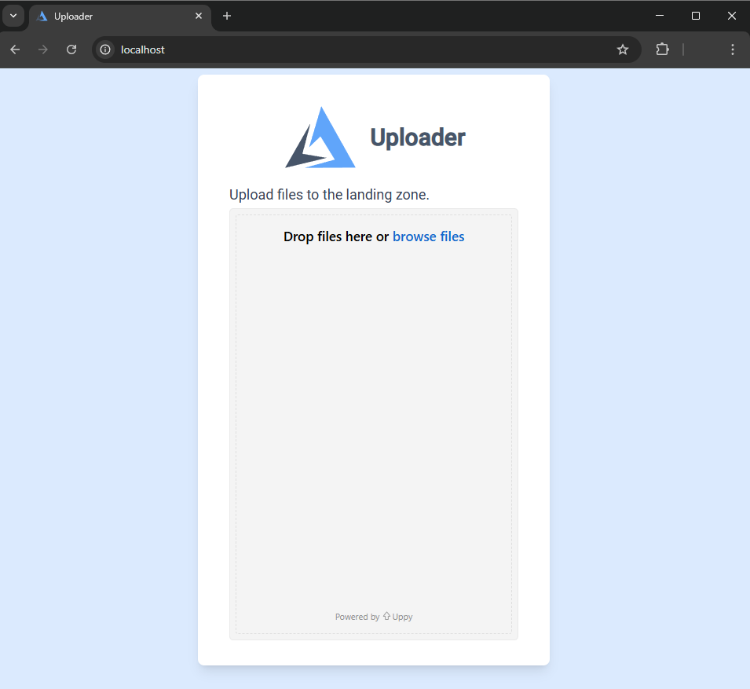

# File Upload Tool with LDAP Auth

Uses:
- [Caddy](https://caddyserver.com/) Proxy with [AuthCrunch](https://docs.authcrunch.com/)
    - Authenticate with LDAP
    - Authorize specific Roles
    - Serve Static Files
    - Proxy Tusd
- [Tusd](https://tus.github.io/tusd/)
    - Server for `tus` resumable upload protocol
- [Uppy](https://uppy.io/)
    - Frontend for file uploads
- a [pre-filled LDAP Server](https://github.com/rroemhild/docker-test-openldap) for demonstration

## Run

```bash
docker compose build
docker compose up
```

Open [`http://localhost/`](http://localhost/)

## Features
- Frontend for Login and File Upload.
- Login is required.
- Specific roles are required:
    - User `fry` with password `fry` can log in, but does not have the right role and sees `Forbidden`.
    - User `professor` with password `professor` can log in and upload files.
- File uploads can be paused, resumed, and recovered.


## Screenshots



